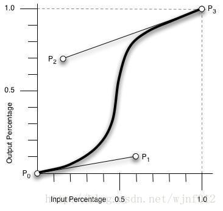

# 理解CSS3贝塞尔曲线(cubic-bezier)

+ 什么是贝塞尔曲线曲线？

cubic-bezier称为三次贝塞尔曲线，主要是生成速度曲线的函数，规定是cubic-bezier(<x1>,<y1>,<x2>,<y2>) . 
从下图中我们可以看到，cubic-bezier有四个点： 两个默认的，即：P0(0,0)，P3(1,1)； 两个控制点，即：P1(x1,y1)，P2(x2,y2) 
注：X轴的范围是0~1，超出cubic-bezier将失效，Y轴的取值没有规定，但是也不宜过大。只要调整两个控制点P1和P2的坐标，最后形成的曲线就是动画曲线。



+ 几个常用的固定值对应的 cubic-bezier 值以及速度曲线

``` 
 1、 ease：cubic-bezier(.25, .1, .25, 1)
 2、 liner：cubic-bezier(0, 0, 1, 1) / cubic-bezier(1, 1, 0, 0)
 3、 ease-in：cubic-bezier(.42, 0, 1, 1)
 4、 ease-out：cubic-bezier(0, 0, .58, 1)
 5、ease-in-out：cubic-bezier(.42, 0, .58, 1)
```

+ 由于涉及到一些数学知识，这里就不展开讨论，实际项目中知道运用的场景以及如何运用即可。