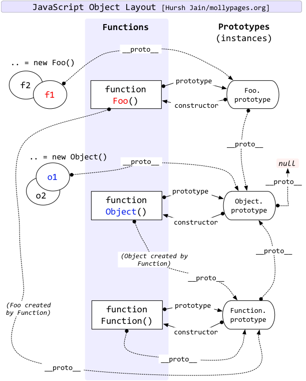

# ES 5相关知识点

+ LHS和RHS查找机制、作用域、作用域链、词法作用域、块级作用域

无论函数在哪里被调用，也无论它如何被调用，它的词法作用域都只由函数被声明时所处的位置决定。
eval()和with会在运行时修改或创建新的作用域，以此来欺骗其他在书写时定义的词法作用域，欺骗词法作用域会导致性能下降。ES 3规范中的try...catch的catch子句具有块作用域。
严格模式下禁止使用with，而eval会创建一个新的属于它自己的作用域。

+ 变量声明提升

除了let和const声明的变量外，作用域中的其它变量的声明都会提到当前作用域顶部，但赋值会留在原地。另外函数声明提升的优先级比变量声明高。

+ JS中的函数传值是值传递而不是引用传递。

+ 关于this：谁调用this就是指谁

四条this绑定场景的优先级：
1. 函数是否在new 中调用（new 绑定）？如果是的话this 绑定的是新创建的对象。
var bar = new foo()
2. 函数是否通过call、apply（显式绑定）或者硬绑定调用？如果是的话，this 绑定的是指定的对象。
var bar = foo.call(obj2)
3. 函数是否在某个上下文对象中调用（隐式绑定）？如果是的话，this 绑定的是那个上下文对象。
var bar = obj1.foo()
4. 如果都不是的话，使用默认绑定。如果在严格模式下，就绑定到undefined，否则绑定到全局对象。
var bar = foo()

TIPS: 如果把null 或者undefined 作为this 的绑定对象传入call、apply 或者bind，这些值在调用时会被忽略，实际应用的是默认绑定规则
TIPS: 箭头函数不使用this 的四种标准规则，而是根据外层（函数或者全局）作用域来决定this。

+ 关于闭包：当函数可以记住并访问所在的词法作用域时，就产生了闭包，即拿到了本不该属于自己的东西。

闭包的经典面试题
```
for (var i = 0; i < 5; i ++) {
	setTimeout(function timer() {
		console.log(i)
	}, i * 1000)
}
```
上述代码会输出什么？为什么？怎样使得程序每秒输出1到5？请给出至少3种方案。

+ 原型、原型链。看下图即可



 ## 发现问题？
发邮件(547221469@qq.com)给我或直接提issue :joy: